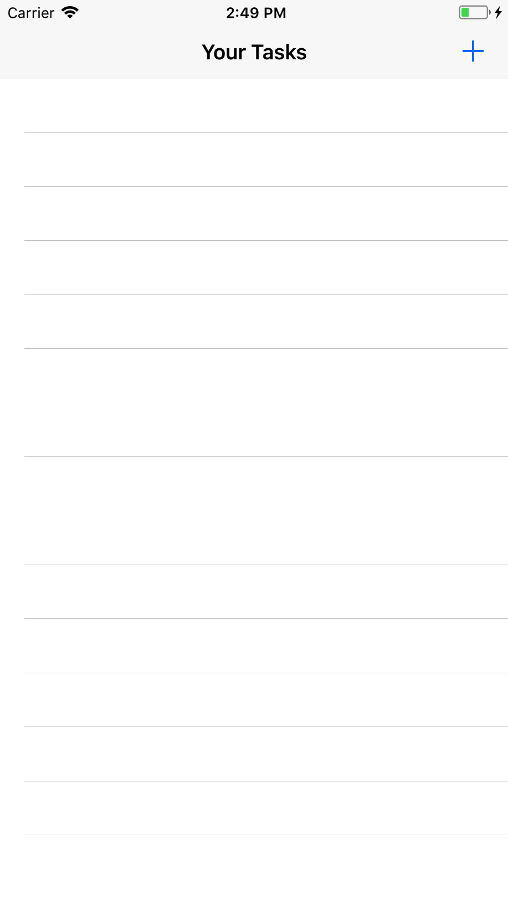
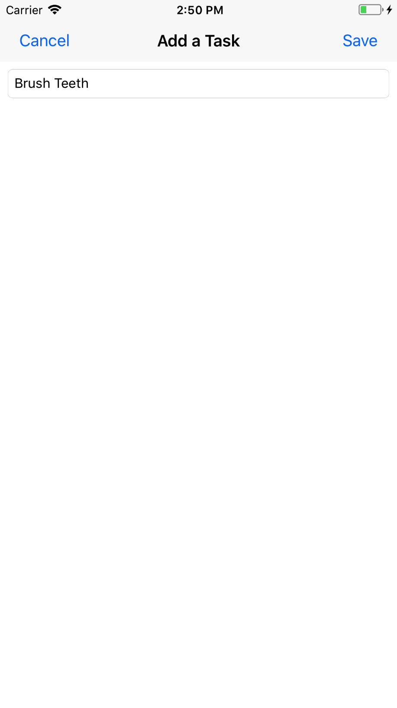
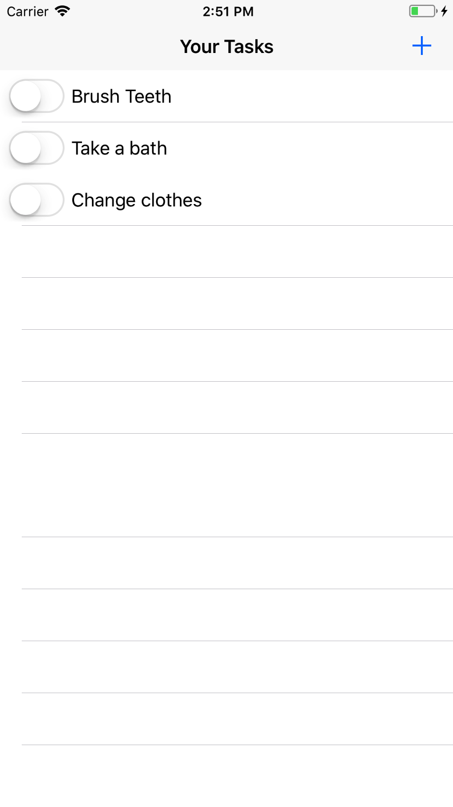
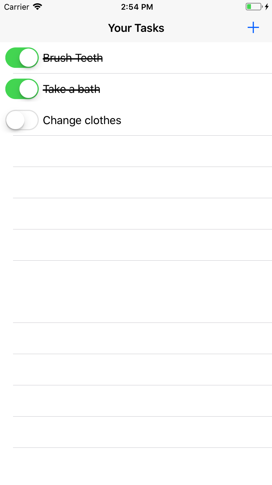

# To Do List in Swift

A To Do List application written in Swift for iOS.

It uses [Realm](https://realm.io/) as its database for persisting data.

# Building and Running the app

To get started, first clone the app, open the `$ cd` in to the folder and run `$ pod install`. Make sure you have [CocoaPods installed](https://cocoapods.org/#install) before running `$ pod install`.

Locate the folder in Finder and open the `To Do List.xcworkspace` in XCode. If `$ pod install` succeeded, and you opened the correct project, everything should work and you will be greeted with an empty screen with no tasks in the app.

Press the Plus (+) button on top left to add a task. Write the task name and press `Save`.

You'll get back to screen with the Task.

Tap the left side of task to change its state to completed.

# TO DO (pun intended)

1. Change the Switch appearance to use the assets.
2. **[DONE]** Add text validation for name to have at least one character.

# License

MIT License.